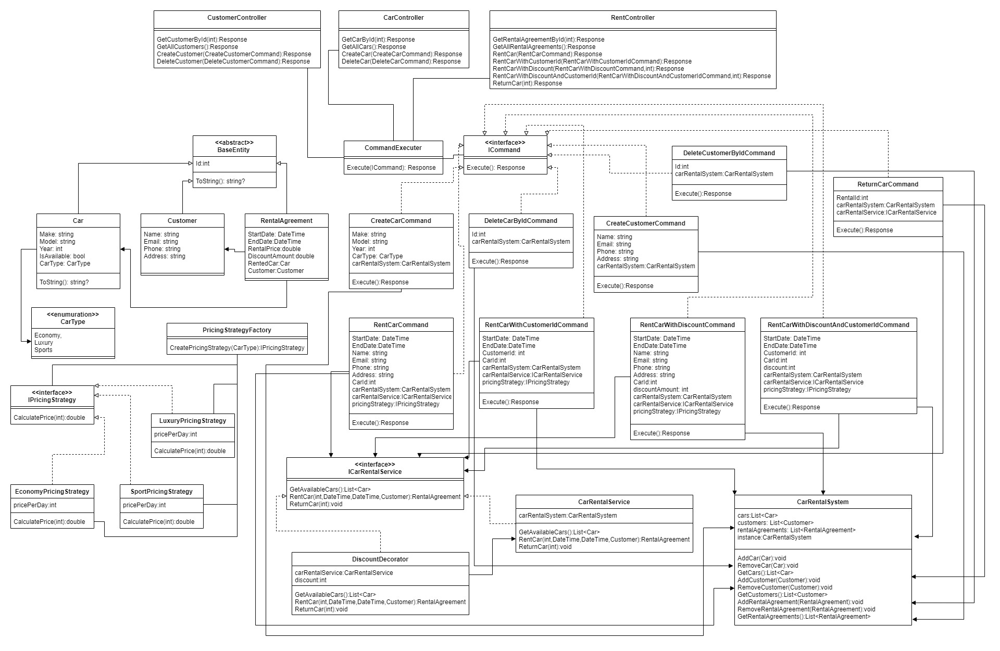
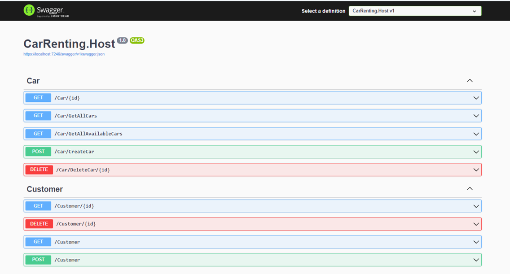
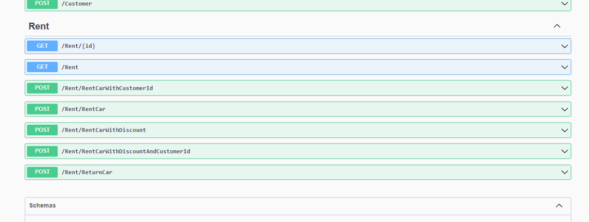

# Car Renting Web API Documentation

<!-- Badges -->

> This is a simple web API for car renting. It is a project for the course "Design Patterns" at the Faculty of Computer Science.

## Introduction

This project is a simple web API for car renting. It is a project for the course "Design Patterns" at the Faculty of Computer Science. The project is developed using .NET 6.0 and Web API. The project is developed using the following design patterns:

- Singleton
- Factory
- Decorator
- Strategy
- Command

<!-- Explanation of Design Patterns Usage -->

## Singleton

This is a creational design pattern that ensures that only one instance of a class is
created. This could be useful in a car rental project for managing shared resources such as a class that
has list of entities like a database.

## Factory

This is a creational design pattern that provides a way to create objects without
specifying the exact class of object that will be created. This is useful in a car rental project because it
allows you to create pricing strategy with different types of cars.

## Decorator

This is a structural design pattern that allows you to add new behavior to an object
dynamically. This could be useful in a car rental project for adding additional features to rent car such
as Discount decorator.

## Strategy

This is a behavioral design pattern that allows you to change the behavior of an
object at runtime. In a car rental project, this could be useful for implementing different pricing
strategies.

## Command

This is a behavioral design pattern that allows you to encapsulate a request as an
object, which can then be passed around and executed later. This could be useful in a car rental project
for implementing undo/redo functionality for rental bookings or for implementing a workflow for
processing rental requests.

## UML Diagram of the Project

## Features

- Create a new car
- Create a new customer
- Create a new rental
- Get all cars
- Get all customers
- Get all rentals
- Get a car by id
- Get a customer by id
- Get a rental by id
- Delete a car
- Delete a customer
- Delete a rental

And more...

## How to Run the Project

1.  Clone the repository
2.  Open the solution in Visual Studio
3.  Run the project

## How to Use the Project

1.  Open Postman
2.  Import the collection from the repository
3.  Run the requests

## Screenshots

## Feedback

If you have any feedback, please reach out to us at [email](mailto:karagoz.mhmtg@gmail.com).
If you run into a problem, you can let me know here or on my Twitter account. - [@Mehmetkaragoz07](https://twitter.com/Mehmetkaragoz07)

## License

[MIT](https://choosealicense.com/licenses/mit/)
